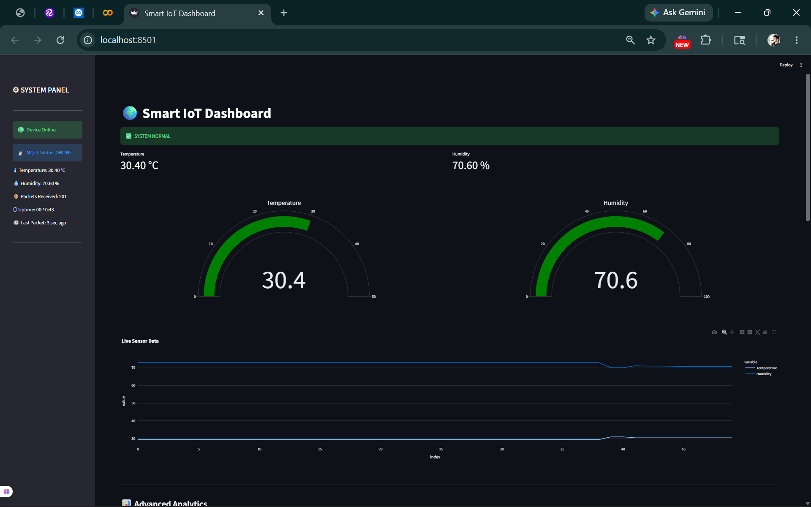
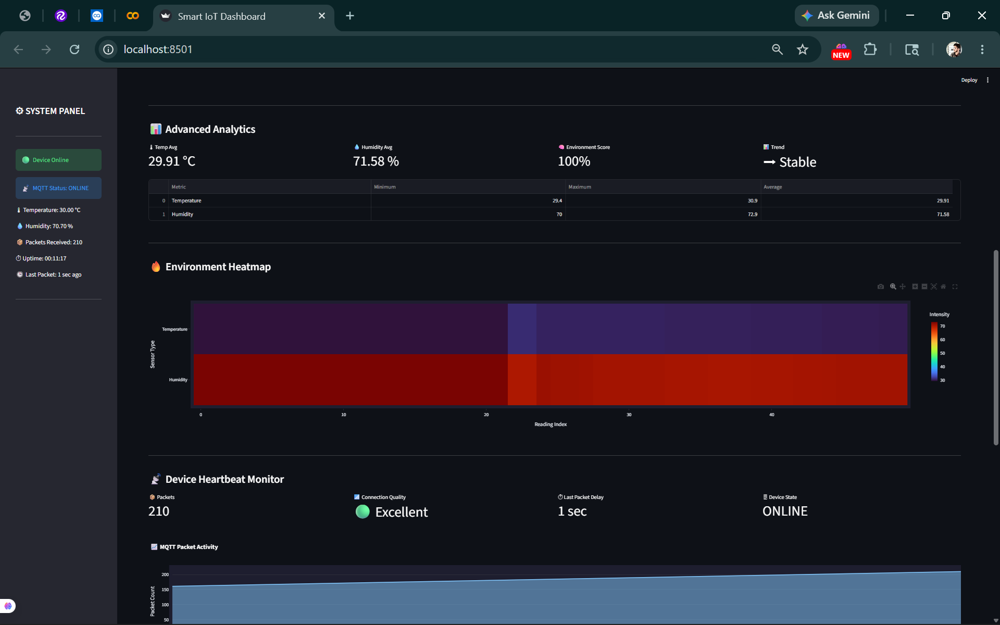
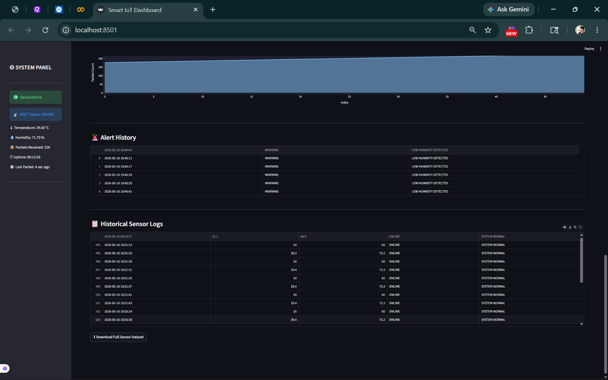
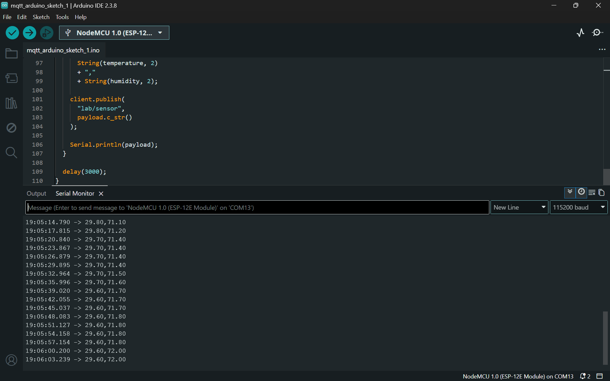

# Smart IoT Dashboard using MQTT, Streamlit & NodeMCU

## Features

- Real-time MQTT communication
- NodeMCU + DHT11 integration
- Streamlit live dashboard
- ThingSpeak cloud upload
- Sensor analytics
- CSV logging system
- Alert generation
- Device status monitoring

## Tech Stack

- Python
- Streamlit
- MQTT
- Mosquitto Broker
- NodeMCU ESP8266
- ThingSpeak
- Pandas

## System Architecture

NodeMCU → MQTT Broker → Python Listener → Streamlit Dashboard → ThingSpeak Cloud

## Setup

### Install dependencies

pip install -r requirements.txt

### Run MQTT Listener

python mqtt_listener.py

### Run Dashboard

streamlit run app.py

## Future Improvements

- AI anomaly detection
- Email/SMS alerts
- Docker deployment
- Multi-device monitoring